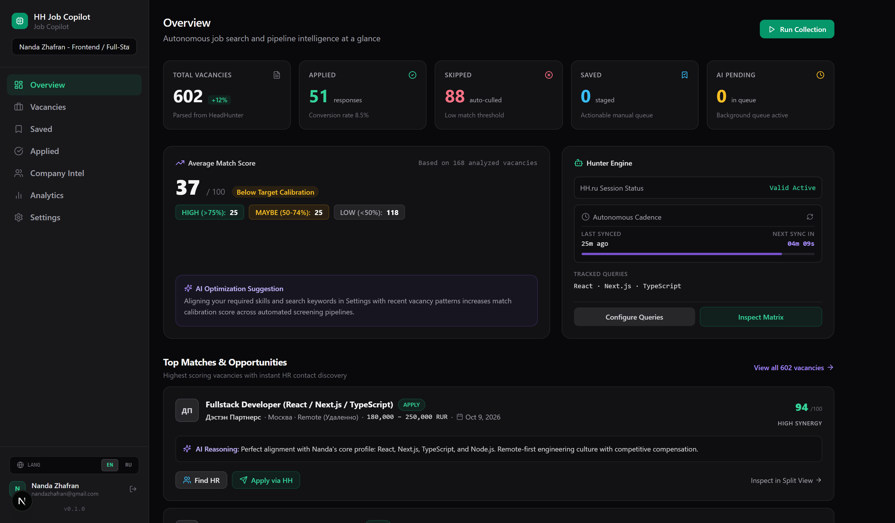
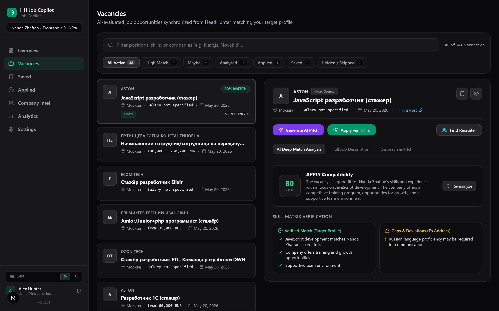
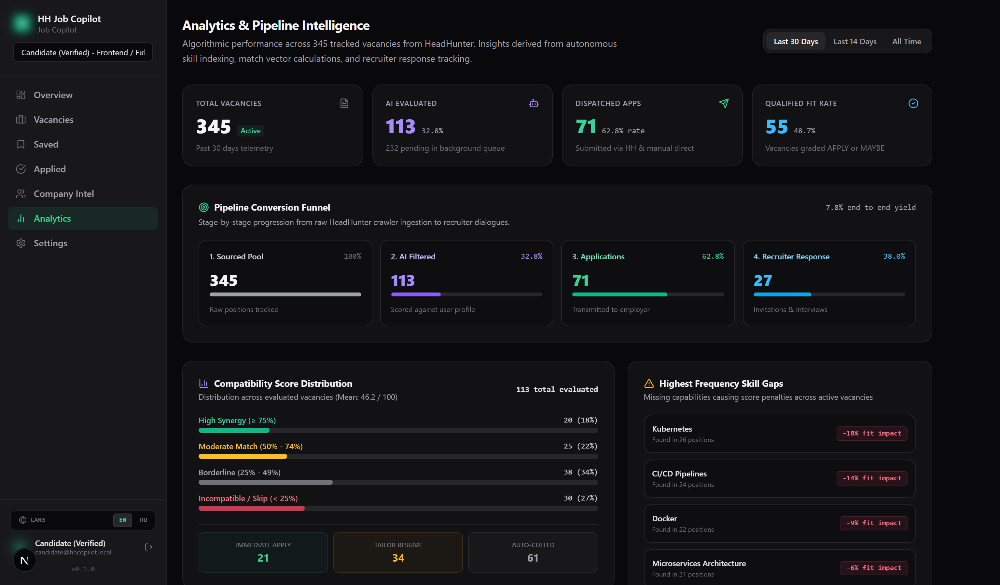
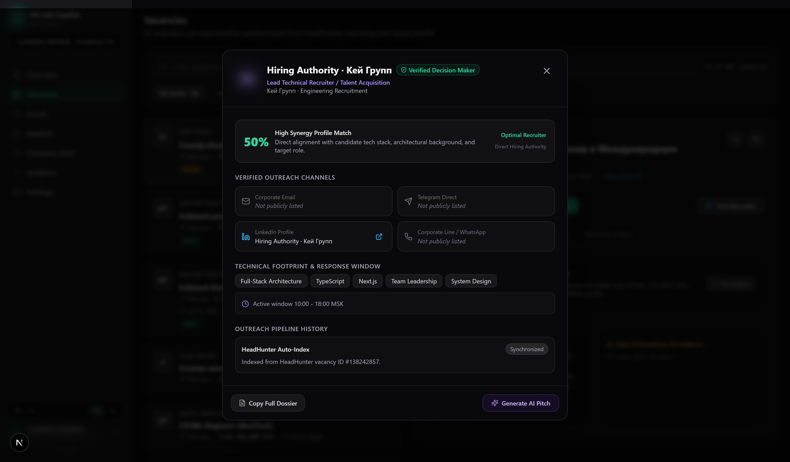

# HH Job Copilot

### Autonomous AI Job Search Copilot for HeadHunter (HH.ru)
*Precision job screening, multi-provider AI reasoning, red-flag detection, and recruiter OSINT.*

---

**English** • [Русский](README.ru.md)

---

> **Public Release Announcement:**
> The project is currently undergoing final real-world testing and UI polishing.
> **The complete source code will be officially unlocked and made public here on October 24–26, 2026.**
> 
> **Star this repository** or hit **Watch** to be notified immediately when the codebase drops.

---

## Preview & Core Capabilities

### 1. Executive Dashboard & Telemetry
Real-time pipeline metrics, automated background collection telemetry, and high-match vacancy cards with instant recruiter discovery.

  

---

### 2. Smart Vacancies Split-View & AI Reasoning
Browse curated vacancies on the left panel while viewing deep compatibility scoring (0–100), technical skill matrix verification, and red-flag alerts on the right panel.

  

---

### 3. Pipeline Analytics & Skill Gap Insights
Track application attrition across the conversion funnel, visualize compatibility distribution, and discover recurring skill gaps to optimize candidate profiles.

  

---

### 4. Recruiter Intelligence & Company OSINT
Bypass the HR black hole. Automatically uncover hiring managers and tech leads via domain OSINT, with tailored cold-outreach drafting adapted to your portfolio.

  

---

### 5. Zero-Setup Local Execution & BYOK
- **No mandatory heavy Docker** — run simply with `npm run dev` or a 1-click `setup.bat`.
- **Bring Your Own Key (BYOK)** — support for DeepSeek (V3/R1), Claude 3.7, OpenAI, Gemini, and local offline models via Ollama.
- **Privacy & Security** — Self-hosted on your machine; credentials encrypted at rest with AES-256-GCM.

---

## Release Roadmap

- [x] **Core Crawler & HH RSS Ingestion Pipeline**
- [x] **Multi-Model LLM Reasoning Engine (DeepSeek / Gemini / Groq / Ollama)**
- [x] **Chrome Extension for 1-Click Session Cookie Sync**
- [x] **Pipeline Conversion Funnel & Skill Gap Telemetry**
- [x] **Telegram Real-time Alert Bot**
- [ ] **Closed Beta Dogfooding & Edge-case Hardening** *(In Progress)*
- [ ] **Public Source Code Release (October 24–26, 2026)**

---

> **Disclaimer:**
> HH Job Copilot is an independent open-source assistive tool created for personal job search automation and telemetry. It is not affiliated, endorsed, certified, or sponsored by HeadHunter LLC (hh.ru). All trademarks belong to their respective owners.

---

*Stay tuned! Follow the repository for the launch.*  
**Engineered for software developers navigating technical job markets.**

