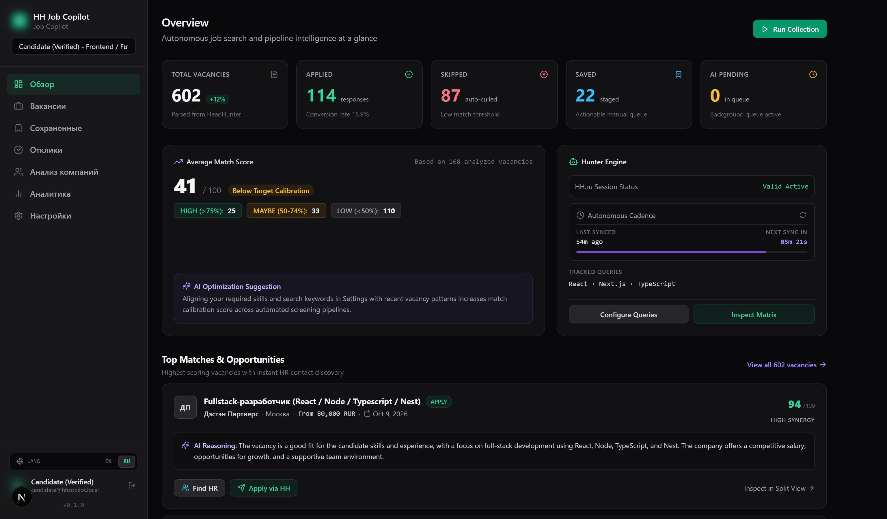
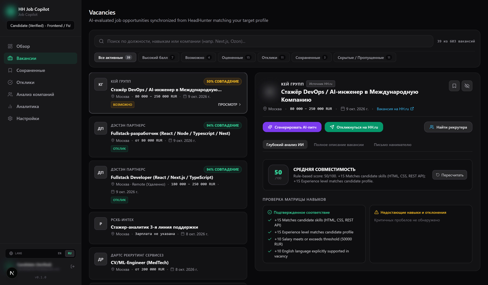
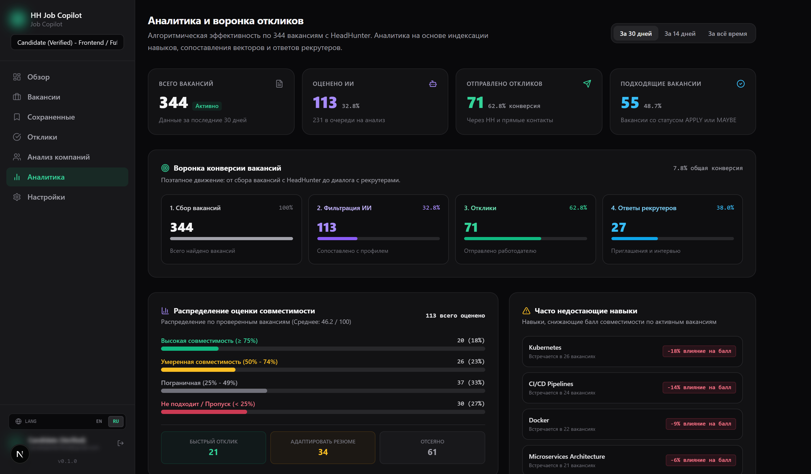
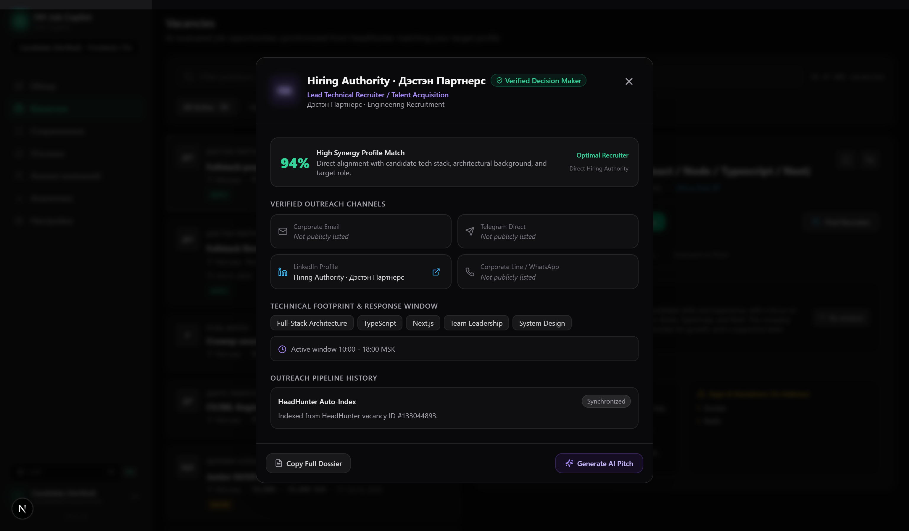
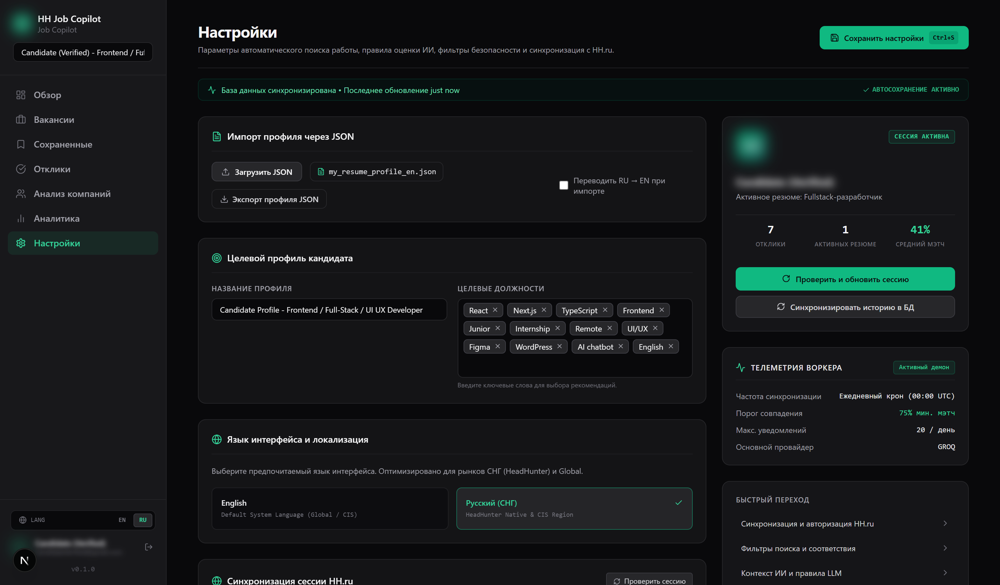

# HH Job Copilot

### Автономный AI-копилот для поиска работы на HeadHunter (HH.ru)
*Интеллектуальный скоринг вакансий, многомодельный LLM-анализ, выявление токсичных редфлагов и поиск прямых контактов нанимателей.*

---

[English](README.md) • **Русский**

---

> **Анонс публичного релиза:**
> В данный момент проект проходит финальное тестирование на реальных данных и полировку интерфейса.
> **Полный исходный код будет официально открыт и опубликован в этом репозитории 24–26 октября 2026 года.**
> 
> **Поставьте Star (звезду) этому репозиторию** или нажмите **Watch**, чтобы получить уведомление в момент открытия кода.

---

## Превью интерфейса

### 1. Главная панель управления (Обзорная аналитика)
Метрики воронки в реальном времени, статус автономного сбора вакансий из HeadHunter и карточки топовых мэтчей с возможностью быстрого поиска контактов HR.

  

---

### 2. Сплит-режим вакансий и глубокий AI-скоринг
Просматривайте актуальные вакансии в левой колонке с мгновенной оценкой соответствия (0–100%), а в правой изучайте детальный технический вердикт, сопоставление навыков (Skill Matrix) и предупреждения о токсичных требованиях (Red Flags).

  

---

### 3. Воронка откликов и анализ пробелов в навыках (Skill Gaps)
Отслеживайте конверсию на каждом этапе (сбор → фильтрация AI → отправленные отклики → ответы рекрутеров) и получайте статистику по технологиям, которые чаще всего снижают ваш балл соответствия.

  

---

### 4. Интеллект по работодателям и OSINT рекрутеров
Обходите бесконечные очереди HR-скрининга. Инструмент помогает находить нанимающих менеджеров и тимлидов компании, генерируя персонализированные питчи под конкретные задачи работодателя.

  

---

### 5. Локальный запуск без сложной настройки (Zero-Setup)
- **Без обязательного тяжёлого Docker** — запуск в одну команду через `npm run dev` или скрипт в 1 клик `setup.bat`.
- **Поддержка любых LLM (BYOK)** — работайте с DeepSeek (V3/R1), Gemini 2.0 Flash, Claude 3.7, OpenAI или полностью локальными моделями через Ollama.
- **Приватность и безопасность** — приложение разворачивается локально на вашем компьютере, сессионные данные шифруются по стандарту AES-256-GCM.
- **База данных без головной боли** — бесплатный Serverless PostgreSQL (NeonDB в 1 клик) либо локальный SQLite (`dev.db`).

---

### 6. Тонкая настройка профиля, LLM-маршрутизация и синхронизация HH.ru
Управление критериями поиска, порогом скоринга, BYOK-ключами моделей (DeepSeek, Groq, Gemini, Claude, OpenAI, Ollama), каскадным переключением при сбоях и безопасной авторизацией через HeadHunter OAuth / Session Token.

  

---

## План релиза (Roadmap)

- [x] **Автономный краулер и пайплайн сбора вакансий с HH.ru**
- [x] **Мультимодельный AI-движок скоринга (DeepSeek / Gemini / OpenAI / Ollama)**
- [x] **Chrome-расширение для синхронизации сессионных куки в 1 клик**
- [x] **Воронка конверсии откликов и телеметрия пробелов в навыках (Skill Gap)**
- [x] **Telegram-бот для мгновенных уведомлений о топовых предложениях**
- [ ] **Закрытое тестирование и финализация документации** *(В процессе)*
- [ ] **Публичный релиз полного исходного кода (24–26 октября 2026)**

---

> **Отказ от ответственности (Disclaimer):**
> HH Job Copilot — это независимый инструмент с открытым исходным кодом, созданный исключительно для личной автоматизации поиска работы и аналитики соискателя. Проект не аффилирован, не поддерживается и официально никак не связан с ООО «Хэдхантер» (hh.ru). Все товарные знаки и наименования сервисов принадлежат их законным правообладателям.

---

*Следите за обновлениями! Добавьте репозиторий в закладки.*  
**Создано для разработчиков, оптимизирующих поиск работы в технологическом секторе.**

